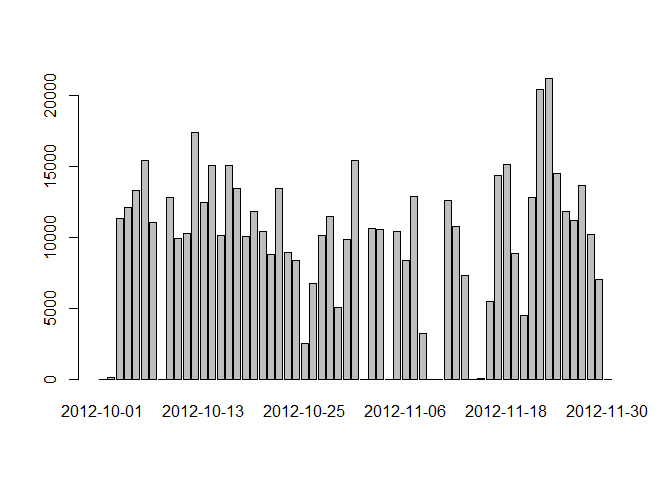
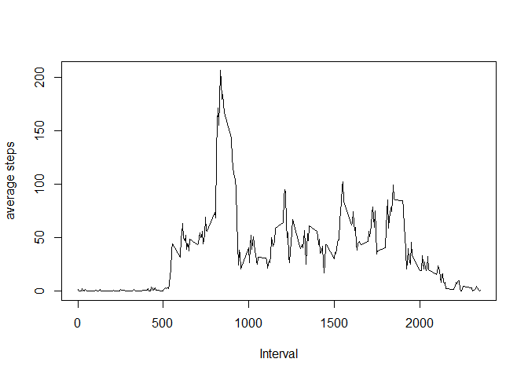
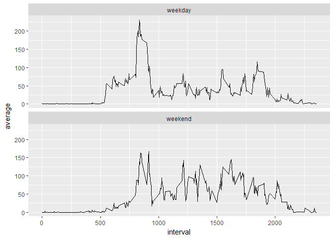

# Reproducible Research: Peer Assessment 1


## R Markdown

This is an R Markdown document for Peer-graded Assignment: Course Project 1.

## Loading and preprocessing the data
Show any code that is needed to  
1. Load the data (i.e. read.csv())  
2. Process/transform the data (if necessary) into a format suitable for your analysis


```r
library(dplyr)
```

```
## 
## Attaching package: 'dplyr'
```

```
## The following objects are masked from 'package:stats':
## 
##     filter, lag
```

```
## The following objects are masked from 'package:base':
## 
##     intersect, setdiff, setequal, union
```

```r
library(ggplot2)
activity <- read.csv("activity.csv", na.strings = "NA", stringsAsFactors = FALSE)
activity$date <- as.Date(activity$date, "%Y-%m-%d")
```

## What is mean total number of steps taken per day?
For this part of the assignment, you can ignore the missing values in the dataset.  

- Make a histogram of the total number of steps taken each day  

```r
activity_date <-group_by(activity, date)
activity_summary <- summarise(activity_date, total_steps = sum(steps, na.rm = TRUE), mean_steps = mean(steps, na.rm = TRUE), median_steps = median(steps, na.rm = TRUE))
barplot(activity_summary$total_steps, names.arg = activity_summary$date)
```

<!-- -->
  
- Calculate and report the mean and median total number of steps taken per day  

```r
mean(activity_summary$total_steps)
```

[1] 9354.23

```r
median(activity_summary$total_steps)
```

[1] 10395
  
## What is the average daily activity pattern?
  
- Make a time series plot (i.e. type = "l") of the 5-minute interval (x-axis) and the average number of steps taken, averaged across all days (y-axis)  

```r
activity_interval <- group_by(activity, interval)
interval_summary <- summarise(activity_interval, avg_steps = mean(steps, na.rm = TRUE))
plot(interval_summary$interval, interval_summary$avg_steps, type = "l", xlab = "Interval", ylab ="average steps")
```

<!-- -->

- Which 5-minute interval, on average across all the days in the dataset, contains the maximum number of steps?  

```r
Maxsteps_interval <- unlist(interval_summary[interval_summary$avg_steps == max(interval_summary$avg_steps),1])
Maxsteps_interval
```

interval 
     835 

## Imputing missing values
  
- Calculate and report the total number of missing values in the dataset (i.e. the total number of rows with NAs)

```r
NA_index <- is.na(activity$steps)
sum(NA_index)
```

[1] 2304
  
- Devise a strategy for filling in all of the missing values in the dataset. The strategy does not need to be sophisticated. For example, you could use the mean/median for that day, or the mean for that 5-minute interval, etc.  
In this section, we will fill the missing number with the mean of the corresponding 5-minute interval
  
- Create a new dataset that is equal to the original dataset but with the missing data filled in.

Combine coding and result for 2 above points

```r
activity2 <- activity
abc <- 1:length(activity2[NA_index,1])
activity2[NA_index,1] <- unlist(lapply(abc, function(abc) interval_summary[(activity2[abc,3] == interval_summary$interval),2]))
activity2_date <-group_by(activity2, date)
activity2_summary <- summarise(activity2_date, total_steps = sum(steps, na.rm = TRUE), mean_steps = mean(steps, na.rm = TRUE), median_steps = median(steps, na.rm = TRUE))
```
  
- Make a histogram of the total number of steps taken each day   

```r
barplot(activity2_summary$total_steps, names.arg = activity2_summary$date)
```

<!-- -->
  
- Calculate and report the mean and median total number of steps taken per day. 

```r
mean(activity2_summary$total_steps)
```

[1] 10766.19

```r
median(activity2_summary$total_steps)
```

[1] 10766.19
  
- Do these values differ from the estimates from the first part of the assignment?  
Yes  
- What is the impact of imputing missing data on the estimates of the total daily number of steps?  
Depend on the data that got imputed in, but most likely the mean and median will increase  
  
## Are there differences in activity patterns between weekdays and weekends?
  
- Create a new factor variable in the dataset with two levels -- "weekday" and "weekend" indicating whether a given date is a weekday or weekend day.  

```r
activity3 <- mutate(activity2, days = weekdays(activity$date))
activity3$days <- as.factor(activity3$days)
weekday_index <- levels(activity3$days) != "Saturday"& levels(activity3$days) != "Sunday"
levels(activity3$days)[weekday_index] <- "weekday"
weekday_index <- levels(activity3$days) != "Saturday"& levels(activity3$days) != "Sunday"
levels(activity3$days)[!weekday_index] <- "weekend"
```
  
- Make a panel plot containing a time series plot (i.e. type = "l") of the 5-minute interval (x-axis) and the average number of steps taken, averaged across all weekday days or weekend days (y-axis). 

```r
activity3_grouped <- group_by(activity3, interval, days)
activity3_summary <- summarise(activity3_grouped, average = mean(steps))
h<-qplot(interval, average, data = activity3_summary, facets = .~days, geom = "line")
print(h)
```

<!-- -->
